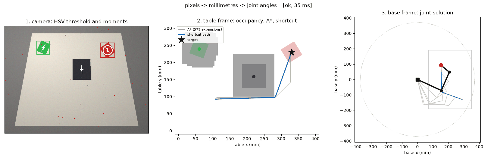

# pick-and-place-stack

A complete 2D robot manipulation stack in Python: a camera looks at a table,
finds a coloured block among clutter and obstacles, plans a collision-free
route to it, and solves the joint angles that put the arm's tip on it.

Camera pixels go in. Joint angles come out. Every stage in between is written
from the maths up, and the whole chain is scored in millimetres against ground
truth rather than eyeballed.



```
python -m ppstack demo --scenario detour

perception   ok      31.2 ms  3 objects
transform    ok       0.1 ms  red at (330, 230) mm
planning     ok       3.6 ms  62 cells -> 3 corners -> 54 waypoints, 315 mm, 573 expansions
kinematics   ok       8.1 ms  54 poses, worst tip error 1.10e-05 mm, 0 branch flips

end-to-end target error vs ground truth: 0.22 mm
arm tip lands at (330.0, 229.8) mm, 0.22 mm from the block centre
```

## Why it is one repo and not three

Detection, path planning and inverse kinematics are each a well-trodden
exercise. The part that is neither well-trodden nor easy is the seam between
them: getting a number measured in pixels, on a tilted camera, into the frame
an arm's joint solver expects, and deciding what the arm should do when
perception hands it something impossible. That is where this repo spends its
effort, and it is the part that is missing from the three separate demos.

## Measured results

All from `python -m ppstack bench`, on 30 randomly generated scenes with known
ground-truth block poses.

### End-to-end accuracy

| quantity | mean | median | p95 | worst |
|---|---|---|---|---|
| block position error | 0.73 mm | 0.75 mm | 0.95 mm | 1.00 mm |
| grasp angle error | 0.18° | 0.13° | 0.40° | 1.08° |
| arm tip landing error | 0.73 mm | 0.75 mm | 0.95 mm | 1.00 mm |
| full pipeline runtime | 43 ms | 42 ms | 51 ms | 55 ms |

Sub-millimetre on a 400 x 300 mm table imaged at 640 x 480, which is about
one pixel. The residual is dominated by the calibration, not by the detector.

### How good does the calibration have to be?

Noise is added to the pixel coordinates of the calibration fiducials, which
simulates clicking them imprecisely.

| fiducial noise | calibration RMS | mean landing error | outcome |
|---|---|---|---|
| 0.0 px | 0.00 mm | 0.82 mm | picked |
| 0.5 px | 0.37 mm | 0.68 mm | picked |
| 1.0 px | 0.75 mm | 0.68 mm | picked |
| 2.0 px | 1.50 mm | 1.11 mm | picked |
| 3.0 px | 2.25 mm | — | **all runs refused by the residual guard** |
| 8.0 px | 6.05 mm | — | **all runs refused by the residual guard** |

Two separate things are being shown. Accuracy degrades roughly linearly with
calibration noise, and past about 2 px the calibration's own residual crosses
the acceptance threshold and the pipeline stops rather than picking somewhere
wrong. Failing loudly is the feature.

### A* heuristics, checked rather than repeated

40 random obstacle fields, 8-connected grid, tie-breaking disabled so the
comparison is clean.

| heuristic | cost / optimal | nodes expanded | time | admissible? |
|---|---|---|---|---|
| zero (Dijkstra) | 1.0000 | 2364 | 6.5 ms | yes |
| euclidean | 1.0000 | 1296 | 4.2 ms | yes |
| octile | 1.0000 | 985 | 3.3 ms | yes |
| manhattan | 1.0015 | 424 | 1.5 ms | **no — worst case 1.030x** |

The octile heuristic expands 2.4x fewer nodes than Dijkstra for an identical
path. Manhattan is faster still and is the trap: on an 8-connected grid it
charges 2 for a diagonal step that costs √2, so it overestimates, and the
measured paths come out up to 3% longer than optimal. That is the textbook
claim, and here it is measured instead of asserted.

## Three things that are genuinely hard

**1. A square has no principal axis.** The standard way to get an object's
orientation is the eigenvector of its second-moment matrix. For a square that
matrix is isotropic, the two eigenvalues are equal, and the returned angle is
pure noise — measured against ground truth it came out at **21.2° mean error on
a ±45° range**, which is chance. The number always looks plausible, which is
what makes it dangerous.

The fix is to use the symmetry the shape actually has. A square is invariant
under a quarter turn, so the right estimator is the fourth-order orientational
order parameter, ψ₄ = Σ wⱼ exp(4iθⱼ), borrowed from condensed-matter physics.
Every corner term of a real square lands in phase; a round or noisy blob
cancels. Same data, same pipeline: **0.18° mean error**, and |ψ₄| doubles as a
confidence score that lets the arm refuse to grasp something that is not a
block. See [`ppstack/perception/orientation.py`](ppstack/perception/orientation.py).

**2. Frames, and the fact that nothing checks them for you.** Pixels are y-down,
table millimetres are y-up, and the arm's base is translated and rotated
relative to the table. Nothing in Python stops you subtracting a pixel from a
millimetre. So every position in this codebase carries its frame as a tag, and
using one in the wrong frame raises `FrameMismatch` rather than producing a
plausible wrong answer. The grasp angle is measured *after* the footprint is
mapped into the table frame, because perspective shears a square and an angle
measured in the image is wrong by a different amount at each corner of the
table. See [`ppstack/frames.py`](ppstack/frames.py).

**3. A four-point calibration cannot tell you it is wrong.** A homography needs
four correspondences and reproduces those four exactly, however badly they were
measured — its residual is identically zero by construction. It is a perfectly
convincing calibration that is off by centimetres. The fix is to over-determine
it: this repo calibrates from a 3x3 fiducial grid so the residual is a real
diagnostic, and `CameraCalibration.validate()` refuses to run the pipeline when
it exceeds the threshold. `from_correspondences` warns if you hand it exactly
four points. See [`ppstack/transforms/calibration.py`](ppstack/transforms/calibration.py).

## Architecture

```
frame (H, W, 3) uint8
        |
        |  perception/        HSV threshold with hue wraparound, morphological
        v                     opening and closing, two-pass union-find connected
   Detection(u, v, angle,     components, image moments, psi4 orientation
             area, footprint)
        |
        |  transforms/        normalised-DLT homography (pixel -> table mm),
        v                     rigid transform (table -> arm base), residual guard
   WorldObject(Point2D in mm, grasp angle, footprint)
        |
        |  planning/          rasterise real obstacle footprints, inflate by the
        v                     robot radius into configuration space, A* with
   [Point2D] path             pluggable heuristic, supercover line-of-sight
                              shortcutting, even resampling
        |
        |  kinematics/        closed-form 2-link IK (Law of Cosines, both elbow
        v                     branches), damped least squares with nullspace
   JointTrajectory            posture control for the redundant case, quintic
                              time scaling, seeded solves for continuity
```

Every stage returns a `StageReport`, and a failure is attributed to the stage
that caused it:

```
python -m ppstack demo --scenario unreachable

perception   ok      25.7 ms  2 objects
transform    FAIL     0.0 ms  red block is 388 mm from the arm base, outside its
                              reachable annulus [0, 370] mm
stopped in transform: ...
```

An out-of-reach block is a geometry problem, not an IK problem, and the
pipeline says so before the solver ever sees the target. The failure modes with
tests behind them are: nothing detected, target colour absent, calibration
residual too large, target outside the reachable annulus, goal walled off,
start or goal buried in an obstacle, IK blocked by joint limits, and a
trajectory that flips elbow branches mid-path.

## Install and run

```bash
git clone https://github.com/BenGreenberg07/pick-and-place-stack
cd pick-and-place-stack
python3 -m venv .venv && source .venv/bin/activate
pip install -e ".[dev]"
```

Only numpy is required. matplotlib is needed for the figures, opencv-python
only for the live webcam mode and the alternative detector backend.

```bash
python -m ppstack demo --scenario detour --plot   # full stack, three-panel figure
python -m ppstack demo --scenario gap --gif out.gif
python -m ppstack bench                           # the tables above
python -m ppstack webcam                          # detector on a live camera
pytest -q                                         # 144 tests, ~3 s
```

Scenarios: `clear`, `detour`, `gap` (a wall with one opening), `clutter`
(several same-coloured candidates), `unreachable` (expected to fail, in the
transform stage).

## The synthetic camera, and why it is the point

`ppstack/perception/scene.py` renders the table by inverse-mapping every pixel
into table coordinates through a real perspective homography, then applies a
lighting gradient, sensor noise and speckle. Because the true block poses are
known exactly, the whole chain can be **scored in millimetres** rather than
eyeballed.

That is the difference between a demo and an experiment. A webcam demo can only
tell you that the box looks like it is on the block; it cannot tell you that
the pick lands 0.73 mm off, that the error is dominated by the calibration
rather than the detector, or that switching orientation estimators moved the
grasp angle from 21.2° to 0.18°. It also means every test runs deterministically
with no camera attached.

The live webcam mode exists to show the detector working on real, noisy input.
It stops after detection, because millimetres require a calibration and a real
calibration requires clicking real fiducials.

## Repository layout

```
ppstack/
  frames.py               frame-tagged points and rigid transforms
  pipeline.py             the stack, wired together, with staged failures
  benchmark.py            the three experiments above
  scenarios.py            named scenes shared by the demo and the tests
  perception/
    scene.py              synthetic overhead camera with ground truth
    color.py              RGB->HSV and hue-band thresholding
    morphology.py         erode/dilate/open/close, union-find components, moments
    orientation.py        psi4 orientation for shapes with 4-fold symmetry
    detector.py           the detector, numpy and OpenCV backends held to parity
  transforms/
    homography.py         normalised DLT, degeneracy detection
    calibration.py        pixel -> table -> base, with the residual guard
  planning/
    occupancy.py          grids, footprint rasterisation, C-space inflation
    astar.py              A* with pluggable heuristics, no corner cutting
    smoothing.py          supercover line-of-sight, shortcutting, resampling
  kinematics/
    arm.py                FK, analytic Jacobian, limits, manipulability
    ik.py                 closed-form 2-link, damped least squares + nullspace
    trajectory.py         quintic time scaling, seeded path following
  viz/render.py           the three-panel figure and the GIF writer
tests/                    144 tests
```

## Notes on the implementation

- **Morphology and connected components are written out, not imported.** The
  numpy implementations are the reference the OpenCV backend is tested against,
  and they let the whole stack run with numpy alone. A parity test pins the two
  backends to identical output.
- **Obstacles are rasterised from their detected footprints**, not from a
  bounding circle at the centroid. A circle around a wall is simultaneously too
  wide across it and too short along it.
- **A* will not cut a diagonal corner** between two blocked cells. A point robot
  can slip through that slit; a real gripper cannot.
- **Line of sight uses a supercover line, not Bresenham.** Bresenham picks one
  cell per column and can hop diagonally between two blocked cells, so a
  shortcut built on it will declare a route clear that passes through a wall.
- **IK solves are seeded from the previous waypoint.** Solved independently,
  adjacent waypoints a millimetre apart can land on different elbow branches and
  the arm snaps through a reconfiguration. Any jump that survives is counted and
  reported rather than silently executed.
- **The damped least squares solver retries from random seeds** before declaring
  a target unreachable, because local descent can stall against a joint limit
  when a solution exists elsewhere in configuration space. 1199/1200 random
  reachable targets solved on the 3-link arm.

## Limitations

Planar and kinematic throughout. There is no dynamics, no gripper model, no
depth, and no closed-loop control: the trajectory is solved, not tracked. The
occupancy grid is built once per frame rather than incrementally, so moving
obstacles are handled only by replanning. Obstacle detection keys on darkness,
which is a stand-in for a real segmentation model. The webcam mode runs
perception only.

## Licence

MIT.
