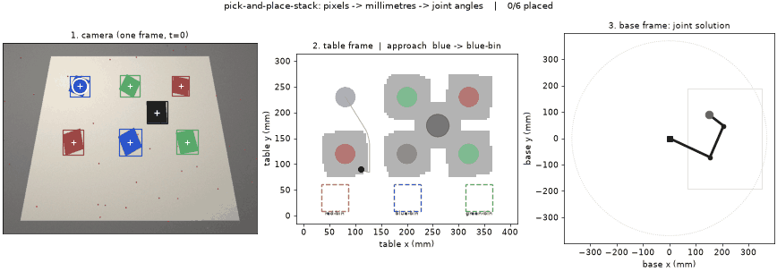

# pick-and-place-stack

A complete 2D robot manipulation stack in Python. A camera looks at a table,
finds coloured blocks among clutter and obstacles, decides what order to move
them in, plans collision-free routes for the *whole arm*, and solves the joint
angles to carry each one to its bin.

Camera pixels go in. Joint angles come out. Every stage in between is written
from the maths up, and the whole chain is scored in millimetres against ground
truth rather than eyeballed.



```
python -m ppstack task --scenario sorting

order: blue->blue-bin -> blue->blue-bin -> green->green-bin -> green->green-bin
       -> red->red-bin -> red->red-bin
6 block(s) placed in 12 segments, 1987 mm of solved path
planned tour 1844 mm vs 2360 mm in detection order (22% saved by sequencing)
365 whole-arm collision checks
```

## Why it is one repo and not five

Blob detection, path planning and inverse kinematics are each a well-trodden
exercise. What is neither well-trodden nor easy is the seam between them:
getting a number measured in pixels, through a tilted and slightly barrelled
lens, into the frame a joint solver expects; noticing that the solver's answer
puts the elbow through a wall; and deciding what to do when perception hands
the planner something impossible. This repo spends its effort on the seams.

Nine things in here are the kind of thing that separates a demo from a system.
Each one is a measured claim, not an assertion, and each has tests behind it.

| | |
|---|---|
| **Square blocks have no principal axis** | The second-moment orientation everyone reaches for is degenerate on a square. Measured on identical data: **22.4° mean error**, versus the 22.5° that uniform noise on a ±45° range would give — it carries no information at all. A ψ₄ order parameter gets **0.20°**. |
| **Reaching a target ≠ being allowed to** | Up to **82%** of the IK solutions that put the tip exactly on a block drive a link through an obstacle. A tip-only pipeline picks one of them. |
| **Redundancy is a manifold, not a number** | A 3R arm's solutions form a continuum. Damped least squares finds one point on it; sweeping the end-effector orientation enumerates the whole thing in closed form. |
| **A 4-point calibration cannot detect its own errors** | It fits its 4 points exactly by construction, so the residual is always zero. Over-determine it, or the guard is theatre. |
| **One mis-clicked fiducial ruins least squares** | 7.54 mm mean error with 3 bad points; RANSAC gives **0.39 mm** and names which ones were bad. |
| **A homography assumes a pinhole** | An 0.12 barrel term costs 2.02 mm and hides in the residual. One scalar, searched for, recovers it to ±0.004. |
| **Greedy data association swaps identities** | **2.2×** the identity switches of optimal assignment under noise. |
| **Manhattan is inadmissible on an 8-connected grid** | It charges 2 for a √2 step. Measured paths come out up to **3% longer than optimal** while looking fast. |
| **Pick order is a TSP** | Sorting into per-colour bins, sequencing saves **22%** of travel over detection order. |

## Measured results

Everything below is `python -m ppstack bench`. It is reproducible, seeded, and
run against synthetic scenes with exactly known ground truth.

### End-to-end accuracy

30 randomly generated scenes.

| quantity | mean | median | p95 | worst |
|---|---|---|---|---|
| block position error | 0.72 mm | 0.73 mm | 0.95 mm | 1.00 mm |
| grasp angle error | 0.17° | 0.11° | 0.40° | 1.08° |
| arm tip landing error | 0.72 mm | 0.73 mm | 0.95 mm | 1.00 mm |
| full pipeline runtime | 41 ms | 40 ms | 49 ms | 55 ms |

And the orientation estimator, run twice on the same detections:

| estimator | mean | median | p95 | worst |
|---|---|---|---|---|
| second-moment principal axis | **22.35°** | 23.90° | 41.04° | 43.67° |
| ψ₄ order parameter | **0.20°** | 0.14° | 0.43° | 1.08° |

Sub-millimetre on a 400 × 300 mm table imaged at 640 × 480, which is about one
pixel. The residual is dominated by the calibration, not the detector.

### Whole-arm collision: what a tip-only pipeline never looks at

Every solution below puts the end effector *exactly* on the target. The
question is what the rest of the arm is doing while it does.

| target (table mm) | IK solutions | in collision | fraction |
|---|---|---|---|
| (60, 250) | 40 | 33 | **82%** |
| (200, 260) | 54 | 22 | 41% |
| (60, 80) | 96 | 24 | 25% |
| (340, 250) | 40 | 0 | 0% |
| (340, 80) | 96 | 2 | 2% |

And what that means when the whole task runs. "Colliding poses" counts solved
configurations in which some link is inside an obstacle:

| scenario | collision-aware | tip-only |
|---|---|---|
| detour | 0 / 163 | **57 / 163** |
| gap | 0 / 100 | **40 / 100** |
| clutter | 0 / 209 | **131 / 209** |
| sorting | 0 / 303 | **78 / 303** |

Both columns place every block and both look completely fine in the tip's
trajectory plot. One of them drives the elbow through a wall on 63% of the
poses in the cluttered scene.

### Task-space A* versus configuration-space RRT*

Two planners for two different problems. A* plans the gripper on a grid, is
optimal on that grid, and is structurally unable to say anything about the
elbow. RRT* samples joint vectors and collision-checks the whole linkage.

| planner | raw cost | after shortcutting | nodes | collision checks | seconds |
|---|---|---|---|---|---|
| RRT* | 5.34 | 3.86 | 659 | 5910 | 1.19 |
| RRT | 6.14 | 4.26 | 105 | 1114 | 0.26 |

Cost is joint-space path length in radians. The rewiring earns its keep: 13%
cheaper raw, 9% cheaper after both are smoothed, for about 5× the work.

### A* heuristics, checked rather than repeated

40 random obstacle fields, 8-connected, tie-breaking disabled.

| heuristic | cost / optimal | nodes expanded | time | admissible? |
|---|---|---|---|---|
| zero (Dijkstra) | 1.0000 | 2364 | 6.5 ms | yes |
| euclidean | 1.0000 | 1296 | 4.2 ms | yes |
| octile | 1.0000 | 985 | 3.3 ms | yes |
| manhattan | 1.0015 | 424 | 1.5 ms | **no — worst 1.030×** |

Octile expands 2.4× fewer nodes than Dijkstra for an identical path. Manhattan
is the trap: fastest, and demonstrably wrong.

### Data association: optimal versus greedy

Identity switches over 30 seeded runs of 4 crossing objects.

| measurement σ | Hungarian | greedy | penalty |
|---|---|---|---|
| 2 mm | 0 | 1 | — |
| 10 mm | 30 | 42 | 1.4× |
| 25 mm | 69 | 143 | 2.1× |
| 40 mm | 100 | 206 | 2.1× |
| 60 mm | 131 | 291 | 2.2× |

Worth saying plainly: at this detector's real accuracy (0.4 mm) the two agree,
and the table above is driven by injected noise. That is the honest version.
The Kalman filter's other job does show up on real output — a track survives a
3-frame occlusion with **0 identity switches** and 0.41 mm mean error, coasting
on its motion model while the detector sees nothing at all.

### Calibration: sloppy clicks, bad clicks, and a curved lens

Accuracy degrades with fiducial noise, and past about 2 px the calibration's
own residual crosses the acceptance threshold and the pipeline **refuses to
run** rather than picking somewhere wrong.

| fiducial noise | calibration RMS | mean landing error | outcome |
|---|---|---|---|
| 0.0 px | 0.00 mm | 0.82 mm | picked |
| 1.0 px | 0.75 mm | 0.68 mm | picked |
| 2.0 px | 1.50 mm | 1.11 mm | picked |
| 3.0 px | 2.25 mm | — | **all runs refused by the guard** |

Sloppy clicking is noise. A click on the *wrong corner* is an outlier, and
least squares has no defence against it — the error gets spread across every
other point, so nothing looks obviously wrong:

| mis-clicked fiducials | least squares | RANSAC | outliers excluded |
|---|---|---|---|
| 0 | 0.41 mm | 0.41 mm | — |
| 1 | 2.93 mm | **0.40 mm** | 8/8 |
| 2 | 5.37 mm | **0.40 mm** | 16/16 |
| 3 | 7.54 mm | **0.39 mm** | 24/24 |

And a homography is only exact for a pinhole. A real lens bows straight lines,
worst at the frame edges, which is exactly where a table's corners are:

| true k₁ | naive RMS | naive error | aware RMS | aware error | k₁ recovered |
|---|---|---|---|---|---|
| +0.00 | 0.34 mm | 0.76 mm | 0.33 mm | 0.71 mm | −0.003 |
| +0.04 | 0.78 mm | 0.69 mm | 0.34 mm | 0.78 mm | +0.037 |
| +0.08 | 1.42 mm | 1.33 mm | 0.34 mm | 0.80 mm | +0.076 |
| +0.12 | 2.02 mm | 2.02 mm | **0.35 mm** | **0.91 mm** | +0.116 |

The distortion parameter needs no extra measurements. For any candidate k₁ you
can undistort the fiducials, fit a homography and look at the residual; the
true k₁ is the one that makes the plane-to-plane map actually *be* a
homography. One scalar, one golden-section search.

## Architecture

```
frame (H, W, 3) uint8
        |
        |  perception/     HSV threshold with hue wraparound, morphological
        |                  opening/closing, two-pass union-find components,
        v                  image moments, psi4 orientation
   Detection(u, v, angle, area, footprint)
        |                          \
        |                           \  tracking/  constant-velocity Kalman +
        |                            v            Hungarian association -> Track
        |
        |  transforms/     radial lens model, normalised-DLT homography
        v                  (RANSAC optional), rigid transform, residual guard
   WorldObject(Point2D in mm, grasp angle + confidence, footprint)
        |
        |  task/           per-colour bins, pick sequencing (exact <=6, else
        v                  nearest-neighbour + 2-opt), world rebuilt per segment
   [(block, bin)] in order
        |
        |  planning/       obstacle footprints rasterised, C-space inflation,
        |                  A* on the tip (pluggable heuristic, no corner
        v                  cutting), OR RRT* on the joints; whole-arm capsule
        |                  collision checking; line-of-sight shortcutting
   [Point2D] path  /  [q] configuration path
        |
        |  kinematics/     closed-form 2-link IK (both elbow branches),
        v                  3R self-motion manifold in closed form, damped least
   JointTrajectory         squares + nullspace, collision-aware branch choice,
                           quintic time scaling, seeded solves for continuity
```

Every stage returns a `StageReport`, and failures are attributed to the stage
that caused them:

```
python -m ppstack demo --scenario unreachable

perception   ok      25.7 ms  2 objects
transform    FAIL     0.0 ms  red block is 388 mm from the arm base, outside its
                              reachable annulus [0, 370] mm
```

An out-of-reach block is a geometry problem, not an IK problem, and the
pipeline says so before the solver ever sees the target. The failure modes with
tests behind them: nothing detected, target colour absent, orientation
undetermined (ψ₄ too low to be a square), calibration residual too large,
target outside the reachable annulus, goal walled off, start or goal buried in
an obstacle, IK blocked by joint limits, **every posture that reaches the target
in collision**, RRT start or goal in collision, no bin accepting a colour, and a
trajectory that flips elbow branches mid-path.

## Two collision problems, not one

This distinction is what makes the whole-arm checking usable rather than
paralysing. The gripper travels in the block plane, so it must avoid every
block on the table. The links travel *above* that plane, so they pass
harmlessly over a 20 mm block and only have to avoid things tall enough to
reach them. The planner builds two grids from the same detections: the tip is
planned against everything, the arm-body checker sees only tall obstacles.

Conflating them makes a naive implementation declare the entire workspace
unreachable, which is how this got found.

## Install and run

```bash
git clone https://github.com/BenGreenberg07/pick-and-place-stack
cd pick-and-place-stack
python3 -m venv .venv && source .venv/bin/activate
pip install -e ".[dev]"
```

Only numpy is required. matplotlib and pillow for the figures, opencv-python
only for the live webcam mode and the alternative detector backend.

```bash
python -m ppstack task --scenario sorting            # full multi-block cycle
python -m ppstack task --scenario sorting --gif out.gif
python -m ppstack task --no-collision-check          # the naive baseline
python -m ppstack demo --scenario detour --plot      # single reach, 3-panel figure
python -m ppstack bench                              # every table above
python -m ppstack bench --quick                      # same, fewer trials
python -m ppstack webcam                             # detector on a live camera
pytest -q                                            # 225 tests, ~11 s
```

Scenarios: `clear`, `detour`, `gap` (a wall with one opening), `clutter`,
`sorting` (8 blocks, per-colour bins), `unreachable` (expected to fail, in the
transform stage).

## The synthetic camera, and why it is the point

`ppstack/perception/scene.py` renders the table by inverse-mapping every pixel
through a real perspective homography and an optional radial lens model, then
applies a lighting gradient, sensor noise and speckle. Because the true block
poses are known exactly, the whole chain can be **scored in millimetres**.

That is the difference between a demo and an experiment. A webcam demo can only
tell you the box looks like it is on the block. It cannot tell you the pick
lands 0.73 mm off, that the error is dominated by calibration rather than
detection, that 82% of the arm postures reaching a given block are in
collision, or that switching orientation estimators moved the grasp angle from
22.4° to 0.20°. `scene.sequence()` extends this to motion and occlusion, which
is what the tracker is scored against.

The live webcam mode runs perception only, and stops there: millimetres require
a calibration, and a real calibration requires clicking real fiducials.

## Repository layout

```
ppstack/
  frames.py               frame-tagged points and rigid transforms
  pipeline.py             single-target stack with staged failure attribution
  task.py                 multi-object cycle, bins, sequencing, world updates
  benchmark.py            all eight experiments
  scenarios.py            named scenes shared by the demo and the tests
  perception/
    scene.py              synthetic camera with ground truth, motion, occlusion
    color.py              RGB->HSV and hue-band thresholding
    morphology.py         erode/dilate/open/close, union-find components, moments
    orientation.py        psi4 orientation for shapes with 4-fold symmetry
    detector.py           detector, numpy and OpenCV backends held to parity
    assignment.py         Hungarian algorithm with dual potentials
    tracking.py           constant-velocity Kalman filters, gating, track lifecycle
  transforms/
    homography.py         normalised DLT, degeneracy detection, RANSAC
    distortion.py         radial lens model, k1 recovered by golden section
    calibration.py        pixel -> table -> base, with the residual guard
  planning/
    occupancy.py          grids, footprint rasterisation, re-inflatable C-space
    astar.py              A* with pluggable heuristics, no corner cutting
    collision.py          whole-arm capsule collision, bisection edge checking
    rrt.py                RRT* in configuration space, randomised shortcutting
    smoothing.py          supercover line-of-sight, shortcutting, resampling
  kinematics/
    arm.py                FK, analytic Jacobian, limits, manipulability
    ik.py                 closed-form 2-link, 3R manifold, DLS, collision-aware
    trajectory.py         quintic time scaling, seeded path following
  viz/                    three-panel figures and the task animation
tests/                    225 tests
```

## Notes on the implementation

- **Morphology, connected components, the Hungarian algorithm and the Kalman
  filter are written out, not imported.** The numpy implementations are the
  reference the OpenCV backend is tested against, and they let the whole stack
  run with numpy alone. A parity test pins the two detector backends to
  identical output.
- **Obstacles are rasterised from their detected footprints**, not a bounding
  circle at the centroid. A circle around a wall is simultaneously too wide
  across it and too short along it.
- **The footprint is subsampled on a 2D lattice, not in raster order.** Striding
  the raster order leaves points far apart along each row and packed down each
  column, and the grid built from them fills with phantom doorways.
- **A\* will not cut a diagonal corner** between two blocked cells, and
  line-of-sight uses a supercover line rather than Bresenham. Bresenham picks
  one cell per column and can hop diagonally between two blocked cells, so a
  shortcut built on it will declare a route clear that passes through a wall.
- **RRT\* edges are checked by bisection**, midpoint first. A colliding edge
  usually fails near its middle, so this finds it in a few checks instead of
  marching in from one end.
- **IK solves are seeded from the previous waypoint.** Solved independently,
  adjacent waypoints a millimetre apart can land on different elbow branches and
  the arm snaps through a reconfiguration. Any jump that survives is counted and
  reported rather than silently executed.
- **The Kalman update uses the Joseph form**, which stays symmetric and positive
  definite under round-off where `(I − KH)P` does not. A covariance that drifts
  out of positive-definiteness breaks the gate, silently.
- **Association gates on Mahalanobis distance**, so a track that has coasted
  through three missed frames will accept a detection 40 mm away while a
  well-observed one will not. A fixed distance threshold cannot express that.
- **The distortion inverse raises rather than diverging.** Past the fold radius
  the fixed point does not exist, and the iteration happily returns
  plausible-looking garbage.

## Limitations

Planar and kinematic throughout. No dynamics, no gripper model, no depth, and
no closed-loop control: trajectories are solved, not tracked. Grasping and
releasing are instantaneous state changes at a waypoint, because there is no z
axis to descend along. Obstacle detection keys on darkness, standing in for a
real segmentation model. The occupancy grid is rebuilt between task segments
rather than incrementally, so moving obstacles are handled only by replanning.
RRT* is available as a planner and benchmarked against A*, but the task
executor uses the grid planner with collision-aware IK by default. The webcam
mode runs perception only.

## Licence

MIT.
